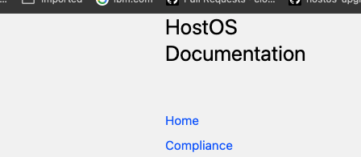

# Contributing Guide

Please follow following procedure  to contribute to this  documentation.

<details markdown="block">
  <summary>
    Table of Contents
  </summary>
____
- TOC
{:toc}
____
</details>

---

## Prereqs

* Be sure to have access to [cloudlab github org](https://github.ibm.com/cloudlab)

## Updating existing doc

1. Clone repo

      ```bash
      git clone  git@github.ibm.com:cloudlab/hostos-reports.git -b master
      ```

2. Create branch

      ```bash
      git checkout -b feature-branch
      ```

3. `Docs` are at root folder, search `title` of the file you want to make change to.

      ```bash
      $ grep -inr 'title: contributing' .        
      ./docs/contributing.md:3:title: contributing 
      ```

4. Make Required changes

    Important
      {: .label .label-ibm-red }

      Please keep images in `attachments` folder, your md file will refer them like this

      ```bash
      attachments/contributing1.png
      ```

5. Create PR

## Adding new doc

1. Create branch

      ```bash
      git checkout -b feature-branch
      ```

2. `Docs` are at root folder, it follows following structure.

      ```bash
      docs
      ├── attachments
      │   └── contributing1.png
      ├── HostOS BRT
      |   ├── Base OS
      │   │   │   ├── 5.5.6/6.5.6/7.5.6
      │   │   │   └── 5.5.5/6.5.5/7.5.5
      ├── contributing.md
      └── index.md

      ```

      Top level directory under `docs` shows current top level section in navigation sidebar

      

3. Add `md` file  under required section.

4. Add required title info based on section you are adding under

      ```bash
      ---
      layout: default
      title: Critical Security Control Failure Monitoring Policies 
      parent: Compliance
      ---
      ```

      Title will refer to Title of your md file.
      nav order will be updated counter of last page in that section.

      Important
      {: .label .label-ibm-red }

      if you are adding new top level section

      * Please create required dir under `docs` folder with new section
      * In Corresponding md file, please add `nav_order:` section to indicate where it should be shown. `nav_order:1` is reserved for `Home`

      if you don't add `nav_order:`, it will be last section page on sidebar.

5. Create PR.
